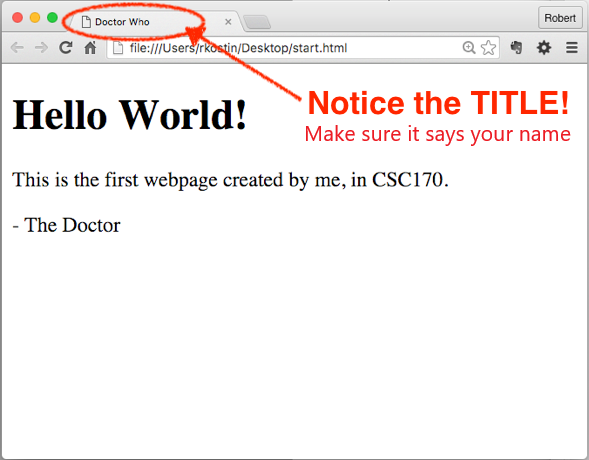

# Lab 1: Account Setup
*Due: Tuesday, January 21, 2019* (before the next lecture)

Your assignment is to create an account on our class web server and practice the steps to create and upload files to the World Wide Web.

## Step 1: Create an FTP account

Your **FTP (File Transfer Protocol) account** is what you will use to copy your web files to the web server throughout the semester.  One of the Teaching Assistants will set it up for you based on information you provide.

In the lab section where you are registered, **find one of the TAs and ask them** to create an FTP account for you.  

- [ ] When the TA is ready, create your **FTP username** 
  - Your username should be the same as your UR **NetID** (*not* your student ID; e.g. *rkostin*)
  - Your username should be all lowercase
  
- [ ] Create your **FTP password**
   - The system will tell you if your password is strong enough (it must be at least FAIR)
   - Suggestion: if your password is less than FAIR, add characters like exclamation points, slashes, uppercase characters, to make your password stronger - and then REMEMBER what you did!

- The TA will complete the process and show you your login credentials
  - Keep that information handy; you will need it for the rest of the semester. 
  - Suggestion: write down the info or take a picture of it with your phone (and remember your password)

In summary, the information you'll need to keep for the rest of the semester:

- **Your FTP Username**
  - Your FTP username will look like an email address – with an “@” in it – but it’s <u>not</u> an email address! That whole thing is your username.)
- **The FTP server name**
  - Note: depending on the software you'll use, the “server” is sometimes referred to as “host name”; they basically mean the same thing
- **The FTP port number: 21**
  - Most FTP programs will automatically enter the “21” for you
- **Your FTP password**
  - There is no automated password reset feature for FTP accounts; if you forget your password you must find a TA to help you manually reset it

## Step 2: Create a simple webpage and view it in a web browser

On your desktop (or anywhere on your computer’s file system including a thumb drive ...which might be a good idea) create a new HTML file.

*NOTE: if you're working on your own computer, Mac or PC, you must make sure your operating system is showing "file extensions."  If you don't know what that is or how to turn them on, ask a TA.*

- [ ] On a PC
  - Right mouse-click anywhere on the desktop and select “New” and then “Text Document”
  - Change the full name of the document from New Text Document.txt (including the extension) to: **start.html**
  - Click Yes to the warning dialog that pops-up.
  - Using a code editor (like Sublime Text), open the **start.html** file.
- [ ] On a Mac
  - Open a code editor (like Sublime Text)
  - Save the current (empty) file to the desktop using the filename: **start.html**
- [ ] In your code editor, enter the following text exactly as shown below
  - Mimic the indentations using tabs or spaces (it doesn’t matter which you use - just try to line-up the text as shown)
  - Where it says “Enter Your Name” (in two places), enter your name
  - Note: the "h1" is the letter "h" and the number "1", not a lowercase L
  - Also note: you need ALL the code below, starting with the `<!doctype...` thing at the top...

```html
<!doctype html>

<html>

	<head>
		<meta charset="utf-8">
		<title>Enter Your Name</title>
	</head>

	<body>
		<h1>Hello World!</h1>
		<p>This is the first webpage created by me, in CSC 170.</p>
		<p>- Enter Your Name</p>
	</body>

</html>
```

- Save the file  
- Open the **start.html** file in a web browser (double click it).  You should see something like this...<br>

If there are problems, check your handiwork for mistakes in the code editor.  Then re-save and refresh the web browser.

If it all looks good, close the code editor and web browser before continuing.

## Step 3: Access your FTP account using FTP Software

The PCs in your assigned lab have FTP client software installed: “WinSCP” and the Macs have: “Cyberduck.”  You can use them there or install WinSCP, Cyberduck, or another FTP application on your own computer (recommended).

To install your own: **WinSCP** (Windows only) go to [winscp.net/eng/download.php](http://winscp.net/eng/download.php)<br>...then click the green button, “DOWNLOAD WINSCP...”

After you install WinSCP, open it

- In WinSCP, click the New Site button to create a new session
- Change the File protocol to “FTP”
- In the Host name field, User name field and Password field, enter the FTP server information that you wrote down in Step 1.
- Ensure the Port number is set to “21”
- Click the Login button OR If you’re using your own computer: click the Save button, then Login

To install **Cyberduck** go to: [cyberduck.io](http://cyberduck.io)<br>
...then click “Download,” for Windows or OS X

After you install Cyberduck, open it

- In Cyberduck, click the Open Connection button
- In the Server field, Username field and Password field, enter the FTP server information that you wrote down in Step 1.
- Click Connect

If you were successful, your FTP client will connect you to the file space on the web server where you will put your web files.  Any files in that space will be accessible on the Web.

## Step 4: Upload and check your HTML document

- [ ] In the file system of your computer (e.g. on the Desktop - or wherever you're working), find your **start.html** file into and drag it the open FTP window to upload it to your account on the web server.

- Open a web browser and go to this web address, below, where “*username*” is the username that you created in Step 1 (example: **rkostin** -- *not* your FTP login with the @...)

   `www.csc170.org/username/start.html`

If you did everything correctly, you should see your simple webpage with your name on it. 

## Step 5: Log your work in Blackboard
In our CSC 170 area in **Blackboard**, in the Lab 1 assignment, create a submission where you will post *a link* to your webpage (not the actual file) to receive credit for this Lab.  

- [ ] Click the "Write Submission" button then paste your link in the box that appears. (Do not upload the HTML file to Blackboard.)

**Extra credit (not really):** send an email to your family with a link to your webpage as proof that you’re actually doing something at college.  
