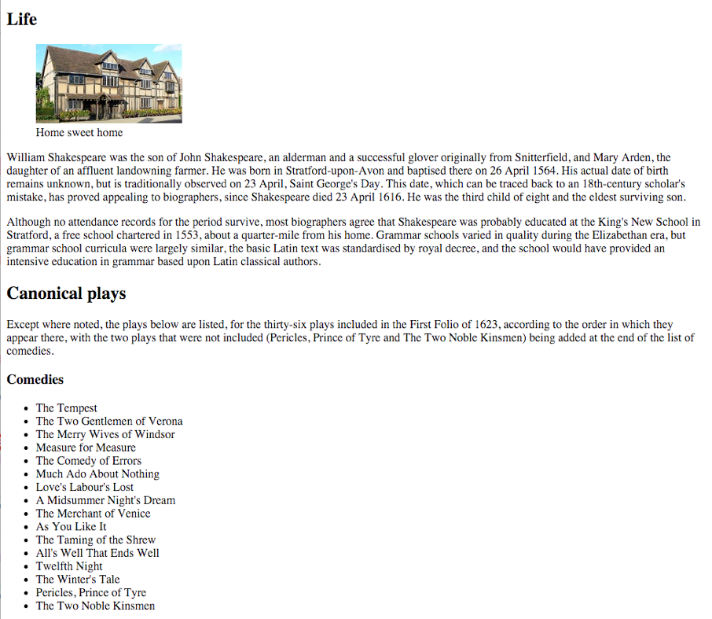

# Lab 4: Structured HTML Document
*Due: Monday, February 3, 2020* (before the next lab)

This assignment builds on your ability to take "real" content (from lab 3) and mark it up using semantically correct HTML. You will use the content you prepared and fulfill the requirements as described below.

## 1. Setup your Work Environment

- Create a folder named **lab04** and inside it create a folder named **images**
- In the **lab04** folder, create a new HTML document named **start.html**
- Inside the **start.html** file, setup a new HTML5 template.
- In addition to the usual HTML5 template, inside the **BODY** tags, create a set of tags that will be used as your structure. You must use the following tags in your HTML document:  **HEADER, ARTICLE, ASIDE, and FOOTER** ...exactly those, in that order.

 Here's a template you can use to get your layout elements started:

```html
<!doctype html>
<html>
<head> 
	<meta charset="utf-8">
	<title>Lab 04 – the title of your content</title>
</head>
<body>

<header>
</header>

<article>
</article>

<aside>  
</aside>

<footer>
</footer>

</body>
</html>
```
NOTE: the four elements above, HEADER, ARTICLE, ASIDE, and FOOTER will contain *all* your content.  When you're done, there should be nothing in-between those four elements.

## 2. Load your Content in the HTML Document

*This is the point of this lab*: **You must figure out how best to semantically tag your content to identify each part of content** WITHIN the prescribed structure (header, article, aside, and footer).

Using your content from Lab 3, extract the text and images and fill the structure as follows:

- [ ] In the **HEADER**, use one (and only one) **H1** for the name of the topic you selected from Lab 3
- [ ] Also in the **HEADER**, create a subtitle (there is no "subtitle" tag, so use a **DIV**)
- [ ] At least three second-level headings (**H2**s) and their associated paragraphs go in the **ARTICLE**
- [ ] The second-level heading (another **H2**) with the lists (and associated paragraphs, if any), goes in the **ASIDE**
- [ ] The last headings (two more **H2**s), Citations and Source, along with their text go in the **FOOTER**, coded appropriately
    -   Note: the "list" of citations is a *list* ...code it as an unordered list with anchor tags
    -   The reference to the source of your content can go in a **P** (if you write it as a paragraph), or a **UL** if you have more than one source and want to show them in a list
- [ ] In the **ARTICLE**, along with your H2s and paragraphs, insert your images
    -   Code the images using the **IMG** tag
    -   Note: the best position in your HTML document for your images is right after an **H2** and before the next **P** (you'll see why when we start adding styles later)
    -   NEW REQUIREMENT: wrap each **IMG** element in a **FIGURE** element (You might want to Google "HTML figure" and "HTML figcaption" to see what they're all about)
    -   Inside the **FIGURE** element along with the **IMG** you must include a **FIGCAPTION** element in which you'll write your caption for the image (You can make up the captions that will go with each image - just a couple of words that describe the image)
- [ ] Feel free to markup any of the content in the document using the **STRONG** tag and/or **EM** tag, but make sure you use them for *semantic* reasons - NOT just to make things bold or italic.  Also feel free to use other HTML tags as you see fit.  (Again, for *semantic* reasons only!)

IMPORTANT: make sure there is *no* content between the structural tags (the **HEADER**, **ARTICLE**, **ASIDE**, and **FOOTER**).  All content must be inside those four structural elements.

Remember: the HTML document MUST remain “semantically pure.”  Use tags for the purpose for which they were invented only!  

- No tags to push content around! That means no **BR**, **HR** or extraneous **P** tags anywhere, and definitely no **B** or **I** tags.

- Do not add **STRONG** or **EM** tags just to make things bold or italics

  - "Strong" means *important*

  - "Emphasis" means ...well, *emphasized*

- Take a look at the [EXAMPLE](#example) at the end of this document. When you’re done, you should have a document that kinda looks like that but with different content.

## 3. Upload your work
When you are done with your webpage, use FTP to access your account on **csc170.org** and upload your files into a new folder named **lab04**

In a web browser (any), go to this address to check your handiwork:  
**www.csc170.org/accountname/lab04/start.html** (where “*accountname*” is your account name)

Remember: All files and folder names must always be all lowercase and no spaces.

## 4. Report your work

Remember: Use the W3C validator ([validator.w3.org](https://validator.w3.org)) to check your work before you report it!

-   In our Blackboard section, in Lab 04, create a new submission and post a link to your webpage to receive credit for this Lab.

## Example

NOTE: Do *not* use Shakespeare for your Lab 4!
*Also note that this example is short - doesn't have enough content! ...you should use all the content as required from Lab 3*



