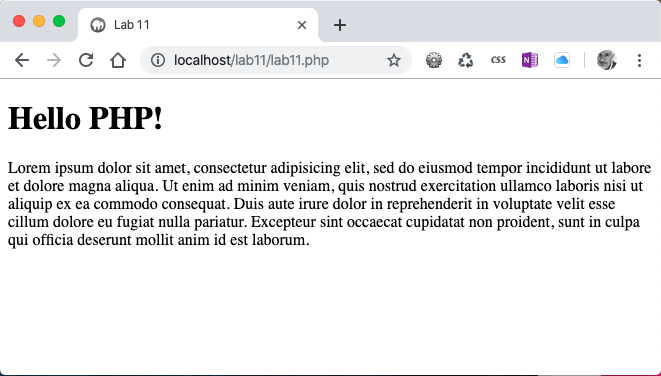
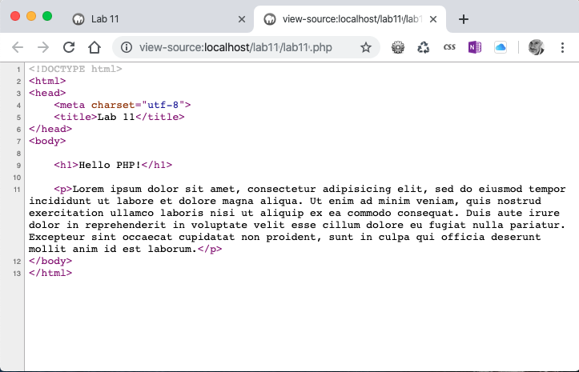

# Lab 11: Localhost (optional - extra credit)
*Due: Wednesday, March 25, 2020*

The point of this lab is to simply demonstrate that you can setup and work with a "localhost" on your own computer. 

**NEW:** Given the situation at the University with the Coronavirus, the three options for working with *PHP Includes* are down to two now:

1. RECOMMENDED: Install a "web stack" like **MAMP** or **MAMP for Windows** on your own computer
2. <s>Use MAMP for Windows which is installed on the computers in any of the labs on campus</s>
3. BACKUP OPTION: Work blindly on your own computer and then FTP (upload) your files to the class web server to check if they're working correctly

**NEW:** This lab is now "extra credit" because the software you're required to install on your own computer may or may not work on your computer for lots of reasons.  If you can't get it to work, it won't count against your grade.

Regarding installation of **MAMP** or **MAMP for Windows**:

- You can use <u>any</u> web stack available in the industry today, not just *MAMP* or *MAMP for Windows*, but the Professor and TAs are most familiar with the *MAMP* products.
- If you can't get any web stack to work on your own computer, no matter.  The back-up option (#3, above) is what you can use for the rest of the semester.

*NOTE: Some of you are already working with your localhost successfully on your own computer. If so, you can jump to **Step 3: Create a Demonstration***

## Step 1: Installation

If you are okay installing a software on your personal computer (recommended):

- Pick a WAMP or MAMP (or LAMP?) software bundle - options were presented in the recent lecture
  - Recommended: [mamp.info](https://www.mamp.info/) ...but be sure to avoid "MAMP Pro"
- Download and install the software onto your computer

*Note: the following step assumse you installed **MAMP** or **MAMP for Windows**. If you're using a different stack, you can still complete this lab. Jump to **Step 3: Create a Demonstration***

## Step 2: Launch and Configure the Software

*This step applies to MAMP or MAMP for Windows only.*

- [ ] Start the **MAMP** or **MAMP for Windows** application

- **Windows users:** if you experience the *Apache server starting then stopping* issue, try this:

  - Launch the MAMP for Windows application
  - Go into **Preferences**
  - Select the PHP section
  - Change the "Standard Version" to: 7.2.14
  - Click okay and wait for the servers to re-start

  You should see the Apache server start and stay lit (green).  If not, let me know in the #help channel in Slack.  There is another fix.

- [ ] **Recommended (both Windows and Mac):** make these changes in *Preferences*


*(Most important: make sure the Apache port is set to **80**)*

*(If you keep all your CSC 170 lab files in a particular folder, set the "path" there!)*

After you've made the suggested changes to the Preferences, above, continue...

- [ ] In the file system of your computer find and open a window to the directory (folder) of the "document root" (sometimes called the "web root")
  - If you followed the suggestion, above, the folder you need to open is simply the place where you keep all your lab files

## Step 3: Create a Demonstration

- [ ] In your document root, create a folder named **lab11**, and inside that create an HTML document named **index.php** 

  - Actually, it doesn't matter what the filename is so long as the file extension ends with **.php**

- [ ] Add a normal HTML5 document structure (doctype etc.) to the file

- [ ] In the BODY tag, add some content - not much, just something like an H1 or something like this: `<h1>Hello PHP!</h1>`

- [ ] Under your little bit of content in the BODY tag, enter a "PHP Include" statement like this: 

  ```php+HTML
  <?php include "content.php"; ?>
  ```

  NOTE: the filename "content" can be whatever you want

- [ ] Then create another file in the same folder; name the file **content.php** (or whatever you used in the *include* statement above)

  - Do **not** fill this other file with an HTML5 document structure! Start with it blank

- [ ] In the new file, add some plain text - lorem ipsum or whatever
  
  - You can use whatever HTML tags you want - like a P tag to wrap around your lorem ipsum text ...whatever makes sense
  
- [ ] Save and close your files

Then check your handiwork in your web browser.  Go to the URL: **localhost**

- **Mac users:** if you get the  "Forbidden" message when opening your localhost in your web browser, post a message in our #help channel in Slack.  We don't know why that's happening, but the TAs and I will work with you in Slack to try and figure that out.

- [ ] Navigate to your webpage (the first file you created) and you should see something like this:



You should see both the HTML page with the H1 **and** the lorem ipsum text

If you just see the H1 **or** just the lorem ipsum text, then you did it wrong.  Go back and figure it out and/or use our #help channel in Slack.

- One more thing: open the *source view* of that webpage.  Notice that you'll see *no* PHP code!  You'll just see the combined HTML code like this...



...that's important to remember!  The server (in this case, your computer) **compiles** the PHP code and performs the *Include* process <u>before</u> the page is served to the web browser (in a millisecond).  

## Step 4: Get Credit

- [ ] Arrange your document root folder and your web browser side-by-side on your computer desktop - something like this:


*Make sure the **path of your folder** and **the URL** in the web browser is clearly visible in the image*

- [ ] **Take a screenshot** of your desktop and save the image (JPG, PNG ...it doesn't matter)
- [ ] In our CSC 170 Blackboard section, in Lab 11, **upload the image file** of your desktop to receive EXTRA credit for this Lab.

